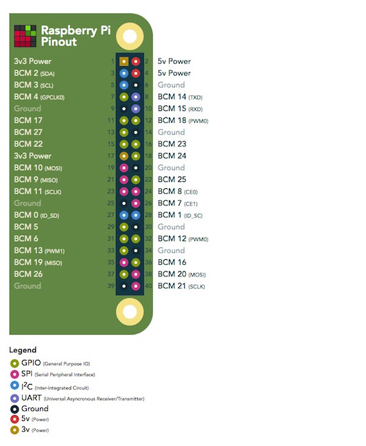
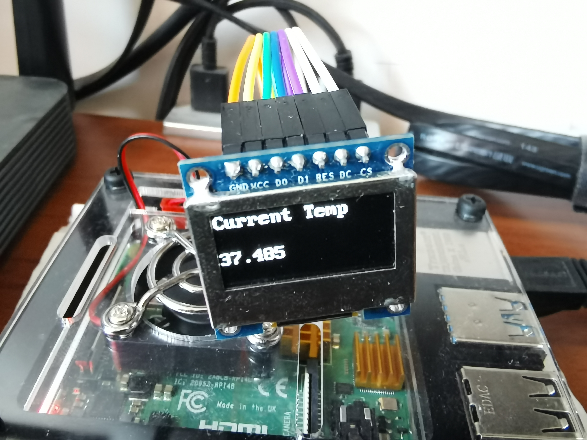

# Pi Temp

A little tool to help you know your Pi's current temperature.

Support **All** raspberry Pi, but only test on Raspberry Pi 4.

## What need ?

Just need a ssd1306 drive OLED using SPI 4-wire protocol.

This tools use Raspberry Pi's SPI1.

### Used Pin

- Vcc - 3.3V
- GND - GND
- D0  - SCLK
- D1  - MOSI
- RES - 5 (BCM)
- DC  - 6 (BCM)
- CS  - 13 (BCM)

#### Example: Raspberry Pi 4

- Vcc - 17
- GND - 25
- D0  - 23
- D1  - 19
- RES - 5
- DC  - 6
- CS  - 13

## Install

